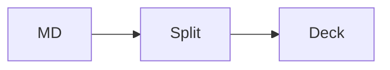
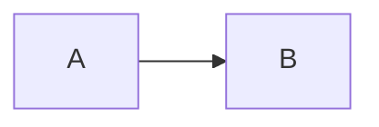

# SLIDE_SPEC — the deck layout contract

This document is the product boundary of CoPlan's deck design system. On one
side: plain CommonMark and a deterministic classifier that assigns every slide
a layout pattern. On the other: a markup contract and a stylesheet
(`deck.css` + `deck-theme-*.css`) that render those patterns. Anything that
implements this spec — CoPlan's Ruby renderer today, a JS implementation
later — produces the same deck from the same markdown.

Two properties are non-negotiable and every rule below serves them:

1. **Determinism.** The same content produces the same deck on every render.
   No measurement, no AI, no randomness in the layout path.
2. **No layout syntax.** Layout is a function of content shape. Authors and
   agents control layout the same way they control everything else: by
   editing the markdown.

## Conformance examples are the test suite

Fenced blocks labeled `conformance` in this document are executable fixtures.
Each contains a slide's markdown, then a line holding a single `.`, then the
expected classification as `key: value` lines:

    ```conformance
    ## Heading

    Some text.
    .
    pattern: content
    step: 1
    ```

A conformance runner turns every block into a test case
(`spec/services/slideshows/conformance_spec.rb`). `pattern` is always
asserted; `step` and `media` are asserted when present. The spec cannot drift
from the implementation, and a future implementation in another language
proves itself against the same fixtures.

## Input: the content sequence

Classification operates on one slide's markdown (boundaries and definition
hoisting are upstream concerns; see `Slideshows::Split`). Parse it as
CommonMark with the host's extensions (CoPlan: footnotes, tables,
strikethrough, autolink, tasklist). The **content sequence** is the slide's
top-level blocks, excluding:

- HTML blocks that consist entirely of comments — speaker notes and other
  comments never influence layout;
- footnote definitions — they render in the document's back matter, not on
  the slide.

Comment boundaries follow the HTML parser that decides what renders:
`<!-->` and `<!--->` are complete (empty) comments, a normal comment runs
to the next `-->`, and a comment opened but never closed swallows the rest
of the block. What renders as nothing classifies as nothing:

```conformance
## The plan


<!-- todo: tighten this caption
.
pattern: stage
step: 1
```

```conformance
## Q3 review

<!--> This sentence is visible on screen, framed by two empty comments. <!-->
.
pattern: content
```

Link-reference definitions are consumed by the parser and contribute no
blocks. Classify the same string the renderer renders — in CoPlan that
includes the hoisted definition preamble, so reference-style images
(`![chart][q3]`) resolve to image nodes here exactly as they do on screen.

Five derived terms:

- **lead heading** — the first block of the content sequence, if it is a
  heading (any level). The **body** is the sequence minus the lead heading.
- **plain text** — a block's visible characters: its text and inline code.
  Image alt text renders as an attribute, zero glyphs on the canvas, so it
  never counts — an image's cost is exactly its image units, however it is
  described.
- **short paragraph** — a paragraph containing no images whose plain text
  is at most 160 characters, counting each hard line break as a full
  line's worth (60 characters). Long enough for a subtitle, a caption, or
  an attribution; too short to be the point of the slide — an image is
  never a subtitle, and neither is a stack of hard-broken lines.
- **media block** — either a paragraph whose inline content is exactly one
  image (optionally wrapped in a single link) and nothing else but
  whitespace and comments, or a code block whose info string's **first
  word** is `mermaid` (the rest of the info string is renderer options,
  which is also how the rendered `lang` attribute treats it).
- **short entry** — a list item holding exactly one paragraph, with no
  images and no hard line breaks, whose plain text is at most 60
  characters: one rendered line, an inventory row. An item carrying more
  structure than that — a nested list, a second paragraph, a long line —
  is an argument, not an entry. Comment-only HTML blocks inside the item
  don't count as structure (comments never influence layout).

## The pattern catalog

Evaluate the rules **in this order; first match wins.** All rules test the
body (the sequence after the lead heading, which any pattern may carry).

| # | Rule (on the body) | Pattern |
|---|---|---|
| 1 | empty, with a lead heading | `title` |
| 2 | one short paragraph, with a lead heading | `title` |
| 3 | one media block ± one adjacent short paragraph | `stage` |
| 4 | one code block ± one adjacent short paragraph | `code` |
| 5 | one blockquote ± one adjacent short paragraph | `quote` |
| 6 | one table ± one adjacent short paragraph | `table` |
| 7 | exactly two lists | `columns` |
| 8 | one list of at least 15 short entries | `directory` |
| 9 | exactly one media block, first or last, plus anything else | `split` |
| 10 | anything else (including an empty sequence) | `content` |

"± one adjacent short paragraph" means the body is either the block alone,
or the block plus one short paragraph immediately before or after it —
a kicker line or a caption. Anything more is a `content` or `split` slide.

Rule 3 sits above rule 4, so a `mermaid` fence is always media, never code.
Rule 9 requires at least one non-media block, so a lone image lands on
`stage`, and requires exactly one media block, so two images fall through to
`content` rather than guessing which one gets the pane.

### `title` — a heading is the slide

The opening slide, a section divider, a one-line claim. Big, confident,
generously inset. The optional short paragraph renders as a subtitle.

```conformance
# Q3 Orders Review

Hampton · August 2026
.
pattern: title
step: 1
```

```conformance
## Part two: what we learned
.
pattern: title
step: 1
```

A long paragraph under a heading is prose, not a subtitle:

```conformance
# Background

This project began as a request from the platform team to consolidate the
four different rendering pipelines that had accumulated over the years into
one well-tested path with a single owner.
.
pattern: content
```

Images are never a subtitle — a paragraph of images under a heading is the
point of the slide, not a caption for the heading:

```conformance
## Before and after

 
.
pattern: content
```

### `stage` — one visual gets the whole canvas

A lone image or mermaid diagram, centered large. A short paragraph beside it
becomes the caption; the lead heading becomes a small kicker above.

```conformance

.
pattern: stage
step: 1
```

Alt text is invisible, so it moves nothing — a thorough accessibility
description classifies exactly like a terse one, and an inline comment
beside the image is a speaker note, not content:

```conformance

.
pattern: stage
step: 1
```

```conformance
 <!-- swap for the final export -->
.
pattern: stage
step: 1
```

```conformance
## The one chart that matters


Checkout conversion, trailing 12 months.
.
pattern: stage
```

````conformance
## How rendering flows


.
pattern: stage
````

Only the info string's first word decides — options after it don't turn
the diagram back into code:

````conformance

.
pattern: stage
step: 1
````

### `code` — code gets the stage, not a text box

One code block, near-full-bleed, syntax highlighted. The lead heading
renders as a kicker; one short paragraph may sit with it.

````conformance
## The whole classifier

```ruby
def pattern_for(body)
  return :title if body.empty?
end
```
.
pattern: code
````

### `quote` — a pull quote, oversized

One blockquote, with an optional short attribution paragraph.

```conformance
> The default output has to be genuinely beautiful with zero effort.

— the design plan
.
pattern: quote
step: 1
```

### `table` — scaled tabular typography

One table, full width, with an optional short paragraph.

```conformance
## Latency by region

| Region | p50 | p99 |
|---|---|---|
| us-east | 12ms | 80ms |
| eu-west | 19ms | 104ms |
.
pattern: table
```

### `columns` — two lists sit side by side

Exactly two consecutive lists. The universal before/after, pro/con,
this-vs-that shape.

CommonMark merges same-marker lists across blank lines into one list, so
two lists are written the way CommonMark makes them: change the bullet
marker, or put a bare comment between them (the standard list-splitting
idiom — and comments are excluded from the content sequence, so
`list, comment, list` classifies as two lists).

```conformance
## Before and after

- four render pipelines
- three owners
- no tests

* one pipeline
* one owner
* conformance suite
.
pattern: columns
step: 2
```

```conformance
## Ship / hold

1. deck view
2. themes

<!-- -->

1. presenter
2. fit report
.
pattern: columns
step: 1
```

A third list, or trailing prose, means the author is writing a document
section, not a comparison — fall through:

```conformance
## Everything at once

- one
- two

* three
* four

And a closing thought that keeps this a document section.
.
pattern: content
```

### `directory` — one long inventory flows into two columns

One list of at least fifteen short entries and nothing else. That shape is
an inventory — every project in flight, the full roster, an API surface —
not an argument, and a single column of it runs off the canvas while half
the slide sits empty. The list flows into two balanced columns; an ordered
list keeps counting down the first column and into the second.

Because the list renders in two columns it also bills at half for the
type scale (see below) — the pattern doesn't just fit the inventory, it
keeps the type readable while doing it:

```conformance
## Every project in flight

- Atlas — payment routing
- Beacon — status page
- Cedar — ledger exports
- Delta — dispute intake
- Ember — fraud scoring
- Flint — invoice search
- Grove — seller onboarding
- Harbor — webhook retries
- Iris — receipt redesign
- Juniper — tax engine
- Keel — capacity planning
- Lumen — audit trails
- Maple — payout scheduling
- Nectar — feedback tagging
- Onyx — rate limiting
- Pine — sandbox reset
.
pattern: directory
step: 2
```

Fourteen entries is a long content slide, not a directory — below the
threshold the list stays one column and bills in full:

```conformance
## Every project in flight

- Atlas — payment routing
- Beacon — status page
- Cedar — ledger exports
- Delta — dispute intake
- Ember — fraud scoring
- Flint — invoice search
- Grove — seller onboarding
- Harbor — webhook retries
- Iris — receipt redesign
- Juniper — tax engine
- Keel — capacity planning
- Lumen — audit trails
- Maple — payout scheduling
- Nectar — feedback tagging
.
pattern: content
step: 4
```

A speaker note tucked inside an entry is still a comment — it neither
breaks the entry's shape nor bills:

```conformance
## Every project in flight

- Atlas — payment routing
- Beacon — status page
- Cedar — ledger exports
- Delta — dispute intake

  <!-- double-check the owner with Maya -->

- Ember — fraud scoring
- Flint — invoice search
- Grove — seller onboarding
- Harbor — webhook retries
- Iris — receipt redesign
- Juniper — tax engine
- Keel — capacity planning
- Lumen — audit trails
- Maple — payout scheduling
- Nectar — feedback tagging
- Onyx — rate limiting
.
pattern: directory
step: 2
```

Every item must be a short entry. One entry carrying real prose means the
list is an argument, and arguments read top to bottom:

```conformance
## Every project in flight

- Atlas — payment routing
- Beacon — status page
- Cedar — ledger exports
- Delta — dispute intake
- Ember — fraud scoring
- Flint — invoice search
- Grove — seller onboarding
- Harbor — webhook retries
- Iris — receipt redesign
- Juniper — tax engine
- Keel — capacity planning
- Lumen — audit trails
- Maple — payout scheduling
- Nectar — feedback tagging
- Meridian — the cross-region failover rehearsal program we keep deferring
.
pattern: content
step: 4
```

### `split` — media pane beside content

Exactly one media block at the body's edge, with real content beside it.
The media's position is part of the classification: first block →
`media: leading` (pane leads), last block → `media: trailing` (pane
trails). Authors move the image in the source to move it on the slide.

```conformance


## What reviewers see

Every slide is a card. Comments anchor to slide text exactly as they do in
documents, so the review loop needs no new tooling.
.
pattern: split
media: leading
```

```conformance
## Rollout status

- beta cohort live
- pricing page updated
- survey drafted


.
pattern: split
media: trailing
```

An image in the middle of the content is illustration flow, not a pane:

```conformance
Intro paragraph.


Closing paragraph.
.
pattern: content
```

### `content` — the workhorse

Heading plus bullets or prose. No special structure; the type scale does
the design work.

```conformance
## What shipped

- Agent identity & attribution
- Library rethink
- Voice comments
.
pattern: content
step: 1
```

## The type scale: steps, not shrink-to-fit

Content volume picks one of four discrete type-scale steps. Sparse slides
render big and intentional; dense slides step down and fit. Steps are
computed from **units** — a deterministic estimate of rendered lines:

| Block | Units |
|---|---|
| heading | 1 |
| paragraph | ⌈plain-text length / 60⌉, minimum 1, plus 1 per hard line break, plus 3 per image |
| list / list item / blockquote | sum of children, minimum 1 |
| code block | ⌈code lines / 1.2⌉, minimum 1 |
| media code block (mermaid) | 4 |
| table | number of rows (header included) |
| thematic break | 1 |
| HTML block (non-comment) | 2 |
| comment HTML block, footnote definition | 0 |

The formulas estimate what the stylesheet actually renders. Plain text
excludes alt text (invisible), and a hard line break forces a rendered
line just as sixty characters do. The code divisor comes from `deck.css`:
code renders at 0.8 em with 1.55 line-height — about ⅚ of a body line per
code line, not half of one. A mermaid fence renders as a fit-to-box
diagram, so it bills like media, not like its source line count.

The slide's units are the sum over its content sequence, with one
pattern-aware adjustment: a `directory` slide's list renders across two
columns, so it bills at ⌈its units / 2⌉. The step:

| Units | Step |
|---|---|
| ≤ 5 | 1 |
| 6–9 | 2 |
| 10–14 | 3 |
| ≥ 15 | 4 |

Step 4 is the floor. Content past what step 4 fits is **reported, not
clipped** — the deck view scrolls the slide and the fit report (phase 5)
flags it to the authoring agent.

```conformance
## Seven points

- alpha
- bravo
- charlie
- delta
- echo
- foxtrot
- golf
.
pattern: content
step: 2
```

```conformance
## Dense

- a1
- a2
- a3
- a4
- a5
- a6
- a7
- a8
- a9
- b1
- b2
- b3
- b4
.
pattern: content
step: 3
```

Hard-broken lines count like list lines — the same content can't dodge a
step by swapping bullets for line breaks:

```conformance
## Agenda

welcome\
retro on the rollout\
the fit report demo\
open floor\
next milestones\
wrap-up
.
pattern: content
step: 2
```

Twenty code lines land on the floor — at step 3 the canvas fits about
seventeen:

````conformance
## The renderer

```ruby
line_01 = compute(1)
line_02 = compute(2)
line_03 = compute(3)
line_04 = compute(4)
line_05 = compute(5)
line_06 = compute(6)
line_07 = compute(7)
line_08 = compute(8)
line_09 = compute(9)
line_10 = compute(10)
line_11 = compute(11)
line_12 = compute(12)
line_13 = compute(13)
line_14 = compute(14)
line_15 = compute(15)
line_16 = compute(16)
line_17 = compute(17)
line_18 = compute(18)
line_19 = compute(19)
line_20 = compute(20)
```
.
pattern: code
step: 4
````

## The markup contract

What the renderer must produce; what the stylesheet may rely on. All
classes live under the `deck-` namespace and everything is scoped beneath
`.deck` — the design system touches nothing else on the page.

```html
<div class="deck" data-deck-theme="coplan">
  <section class="deck-slide deck-slide--content deck-step-2"
           data-slide="4" data-pattern="content">
    <div class="deck-content">
      <!-- the slide's rendered markdown blocks, in source order -->
    </div>
  </section>
</div>
```

- Every slide is a `section.deck-slide` with modifier class
  `deck-slide--<pattern>`, step class `deck-step-<n>`, `data-slide`
  (1-based index) and `data-pattern`.
- The rendered blocks sit inside one `div.deck-content`.
- `split` slides additionally carry `data-media="leading|trailing"`, and
  inside `.deck-content` the media block is wrapped in `div.deck-media` and
  the remaining body blocks in `div.deck-body`, both in source order. The
  lead heading, if any, stays a direct child and spans the panes — and
  lead-ness is the classifier's call, not the DOM's: a raw-HTML heading is
  body content and belongs inside `.deck-body`. If the rendered DOM does
  not match the classified shape — sanitize can delete a raw-HTML block
  wholesale or reduce it to loose text outside any element — the renderer
  must skip the wrappers rather than wrap the wrong nodes or reorder
  visible text around them; the stylesheet degrades to the content layout.

Three invariants protect CoPlan's review loop and hold for every pattern:

1. **No added visible text.** Slide numbers, quote marks, kicker rules —
   all chrome is CSS-generated or structural. Comment anchors count
   visible-text occurrences; deck view must count the same as document view.
2. **No reordering.** DOM order is source order, always. Visual placement
   (a trailing image pane on the left, a spanning heading) is grid/flex
   placement, never node movement across content.
3. **No reliance on host CSS.** `deck.css` styles everything under
   `.deck-slide` from its own tokens. The page around the cards (gaps,
   card borders, the rail) belongs to the host view.

## Themes: validated tokens, never CSS

A theme is a named set of custom-property values, applied by
`data-deck-theme` on `.deck`. Slide canvases take their colors from the
theme, not from the app's light/dark scheme — a deck is a fixed artifact
that looks the same on every screen; only the page around it follows the
app. Users and agents never author CSS; hosts may register additional theme
files at deploy time.

Every theme defines all of:

| Token | Meaning |
|---|---|
| `--deck-bg` | slide canvas background |
| `--deck-ink` | primary text |
| `--deck-muted` | secondary text: captions, kickers, slide numbers |
| `--deck-accent` | headings' companion color: rules, markers, links |
| `--deck-accent-ink` | text placed on accent surfaces |
| `--deck-rule` | hairlines: table rules, quote bars |
| `--deck-title-bg` | title-slide canvas (lets a theme art-direct openers) |
| `--deck-title-ink` | text on the title canvas |
| `--deck-title-accent` | accent on the title canvas (a theme whose title canvas is the accent color must pick a visible one) |
| `--deck-pen` | the presenter's ink: strokes drawn over a slide during a show, and never part of the artifact. Pick something the theme's own accent can't be mistaken for |
| `--deck-title-pen` | ink on the title canvas — optional, falls back to `--deck-pen`. Required only of a theme whose title canvas would swallow it |
| `--deck-font-display` | headings |
| `--deck-font-text` | body |
| `--deck-font-mono` | code |
| `--deck-display-weight` | heading weight |

Launch themes: **coplan** (light, Lexend, blue accent — the default),
**graphite** (near-black canvas, cool ink, sky accent), **poster** (warm
paper, heavy display type, red-orange accent; title slides go full-accent).

Code panels are part of the artifact: one fixed dark panel and one fixed
highlight palette in every theme and every reader color scheme. A host
whose highlighter palette follows its own light/dark mode must pin the
palette inside slides — a deck renders the same on every screen. The same
rule governs diagrams: a rendered diagram takes its colors from the deck
theme, never from the reader's scheme.

## Out of scope here

Slide splitting and definition hoisting (`Slideshows::Split`), speaker
notes, the fit report's budgets, and presenter-mode chrome are CoPlan
concerns documented with their implementations. This spec owns exactly:
the content sequence, the catalog, the steps, the markup contract, and the
theme tokens.
