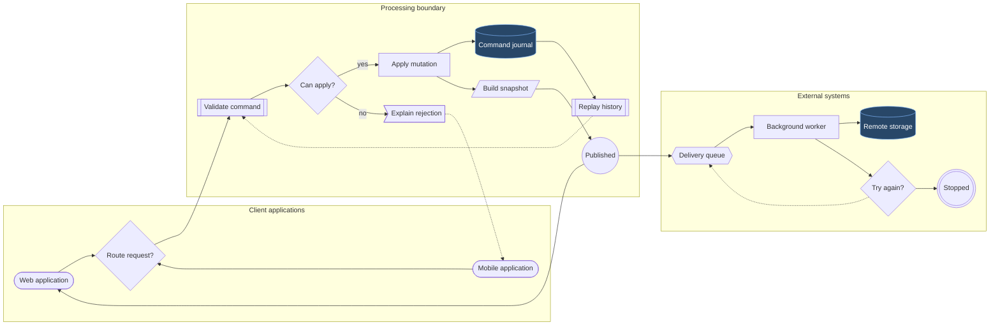
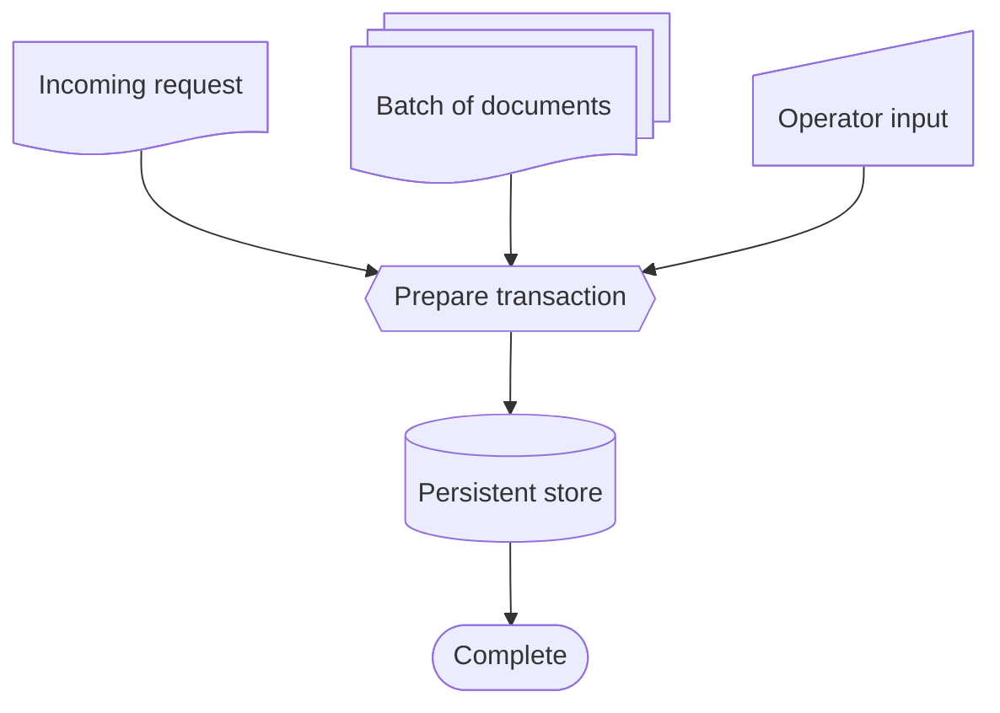
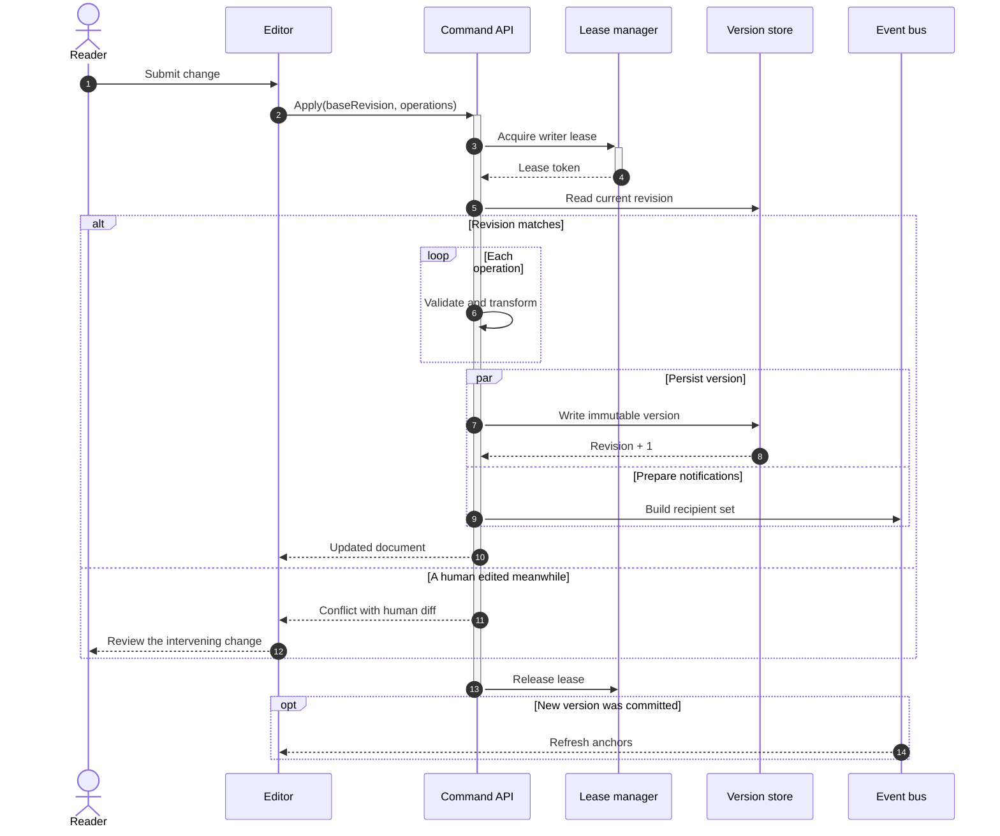
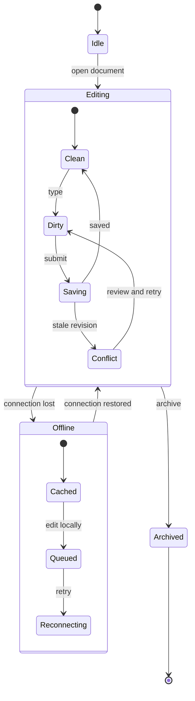
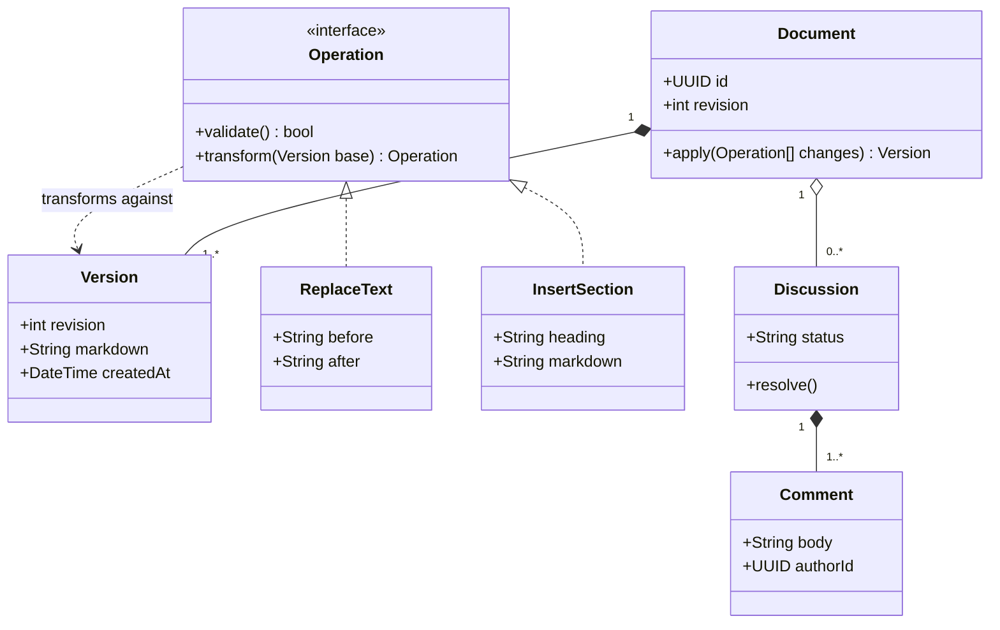
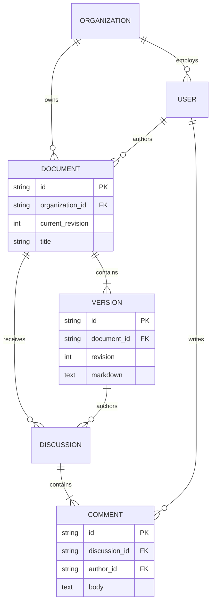
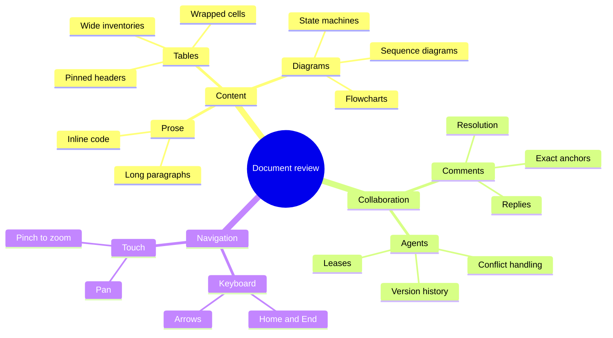
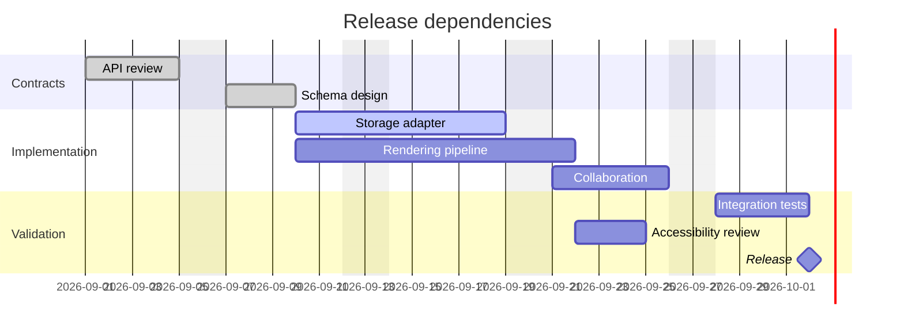

# Mermaid stress gallery

## Flowchart: shapes, nested groups and cross-links

## Expanded shapes: documents and storage

## Sequence: concurrency, retries and failure paths

## State: nested lifecycle and recovery

## Class: contracts, inheritance and multiplicity

## Entity relationships: composite domain

## Mindmap: a broad review surface

## Gantt: dependencies and milestones

